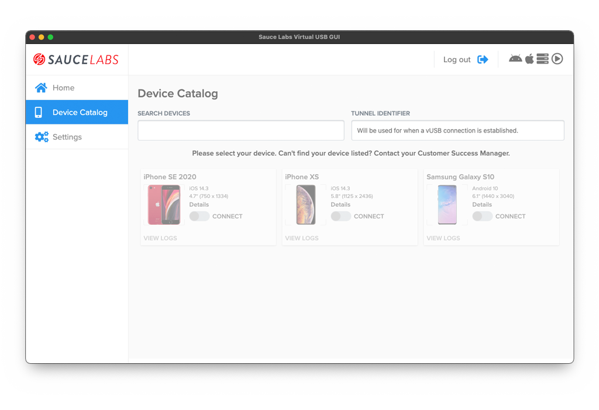
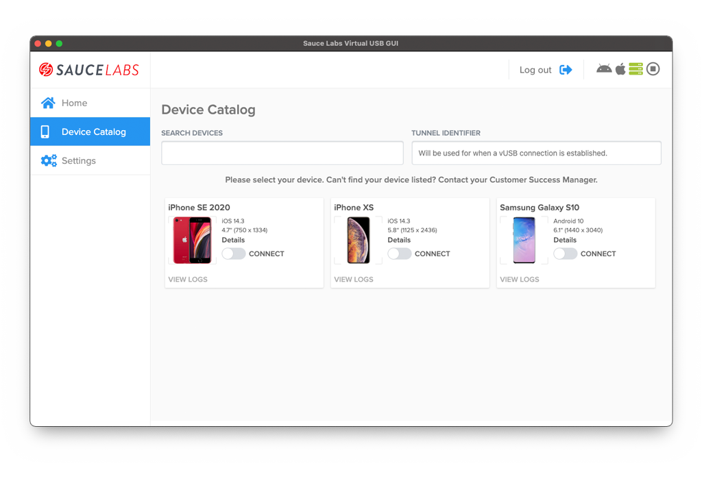
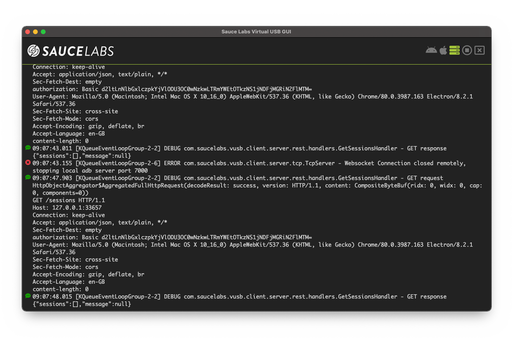
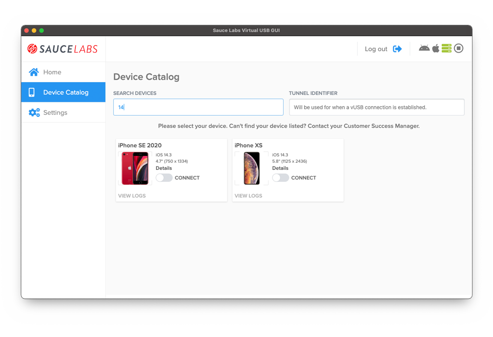
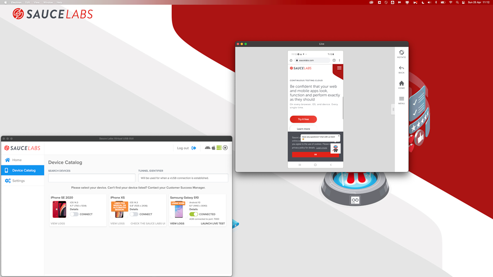
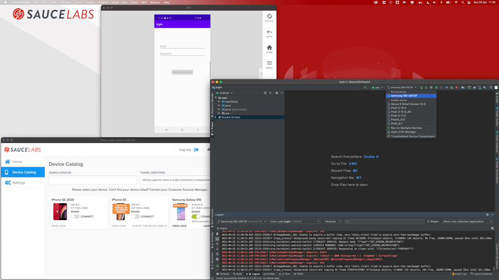
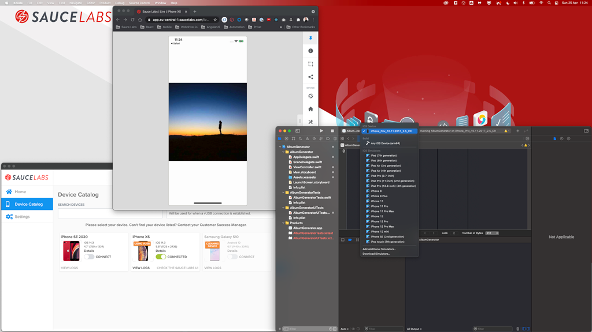

# How to use
> **NOTE:** More information about the screens can be found [here](./docs/SCREENS.md).

When you've [logged in](./SCREENS.md#login) and set all needed settings (see [here](./SCREENS.md#settings)) are set you
will see the below screen

You can't select a device because you first need to start the server, this can be done by clicking on the play-button in
the upper right corner. The screen will update and look like this.

To see the logs of the server click on the green icon, the logs can also be cleared like you normally would do with a 
terminal. The monitor can be closed by clicking on the cross.

You can easily search devices. Each word, minimum is 2 characters long, will be seen as an argument and the device needs 
to match all arguments.

There are two ways to connect to a device. The first way is to connect to a device which is already connected to a live 
manual session which has been started on [Sauce Labs](https://accounts.saucelabs.com). You can recognize such a device 
by it's badge, see the image below.

You can start such a session by: 
- Going to [**Sauce Labs**](https://accounts.saucelabs.com)
- Sign in 
- Select **Live** > **Cross Browser** ()
- Select a private device and launch it

The seconds way is to connect to a device and start a clean session from the vUSB GUI. This device has no badge and is 
enabled to start a connection.

For both situations you connect to a device by clicking on the **CONNECT**-switch.

> **NOTE:** You can also use Sauce Connect, more information can be found [here](./SCREENS.md#tunnel-identifier). 
> After a few minutes the switch will change from `CONNECTING` to `CONNECTED`, see below.

When you now click on **LAUNCH LIVE TEST** a new window will be opened and a new fresh vUSB session will be started.

For Android the device needs to be connected to ADB to use the full power of Sauce Labs Virtual USB. This GUI will do 
that automatically for you, see also the docs [here](./SCREENS.md#automatically-connect-adb) on how to adjust that.

If you want to manually connect the device to your local machine then take the port number that is shown in the GUI and
connect it with ADB like you normally would do.
In this case the device needs to be connected to port `7001` which leads to this command

    adb connect localhost:7001

This will give you the opportunity to connect the device to for example:

- Android Studio and push and debug your app. 
- XCODE and push and debug your app. 
