# Screens

## Table of contents
1. [Login](#login)
1. [Home](#home)
1. [Settings](#settings)
    - [Connection](#connection-settings)
    - [Server](#server-settings)
    - [Server Proxy](#server-proxy-settings)
    - [Device Proxy](#device-proxy-settings)
1. [Device Catalog](#device-catalog)
    - [Input fields](#input-fields)
    - [Connecting to a device](#connecting-to-a-device)
    - [Disconnecting from a device](#disconnecting-from-a-device)
    - [Device statuses](#device-statuses)
    - [Device links](#device-links)
1. [Server monitor](#server-monitor)

## Login
After you have installed the client check the *Login* screen to see if there are no environmental issues, see below.
If you have them please fix them, close the app and restart it.

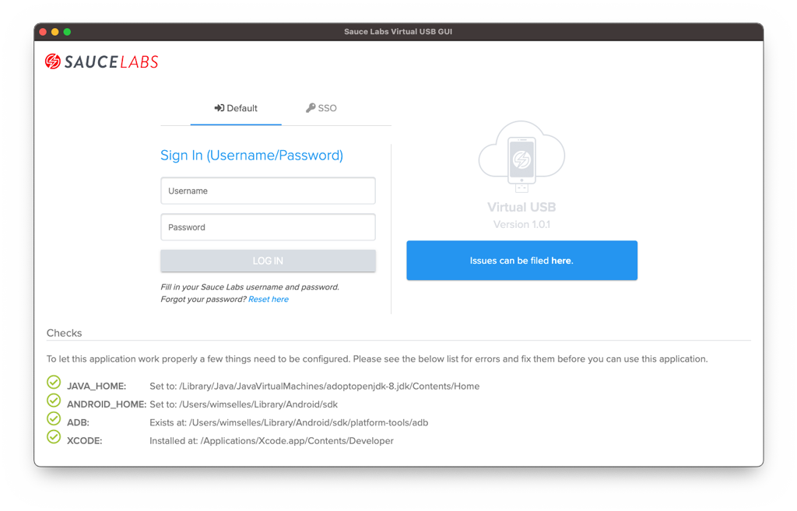

You need to log in with your Sauce Labs `username` and `password` as you would normally do when you
[sign in to the Sauce Labs cloud](https://accounts.saucelabs.com).
If your organisation is using SSO, then please following the steps as described in [this](SSO.md) document.

## Home
The Home screen will be the first screen after logging in. Here you swill see if there are no environmental issues, see
below. If you have them please fix them, close the app and restart it.

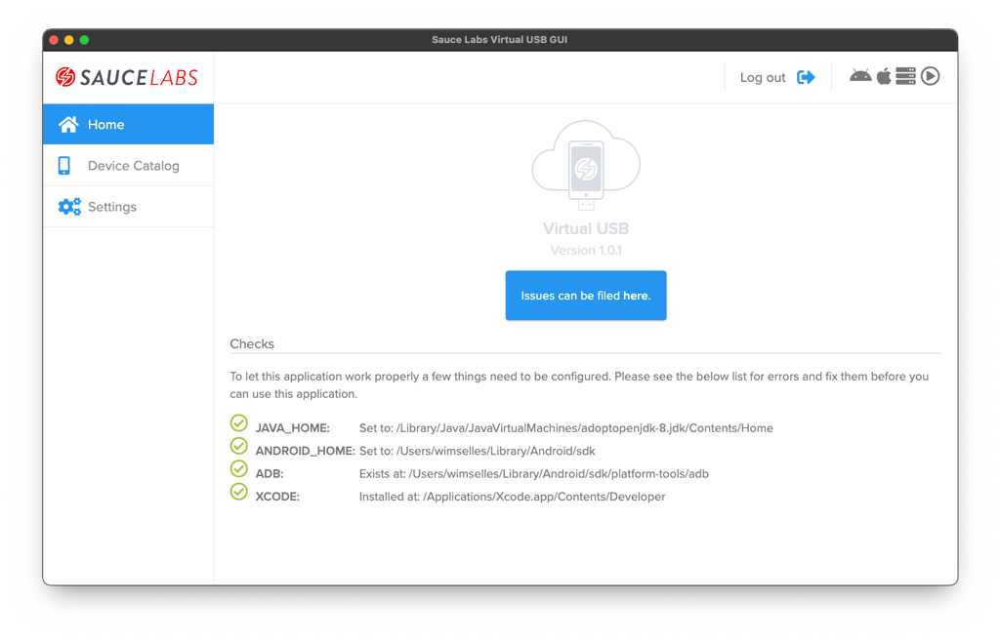

When it is the first time that you use this vUSB GUI you need to set the [settings](#settings). Otherwise you can skip
the settings and go to the [Device Catalog](#device-catalog).

## Settings
When you click on the **Settings** in the left menu you will automatically be redirected to the **Connection Settings**.
You can then change the settings of the [Connection](#connection-settings), [Server](#server-settings),
[Server Proxy](#server-proxy-settings) or [Device Proxy](#device-proxy-settings).

> **NOTE**\
> Check all the settings to see what this Sauce Labs Virtual USB GUI can do for you!

When all *Settings* have been stored the *Device Catalog* can be used (if you didn't store the data properly clicking on
the *Device Catalog* will automatically bring you back to the *Settings*).
After storing the settings you will see a screen like this

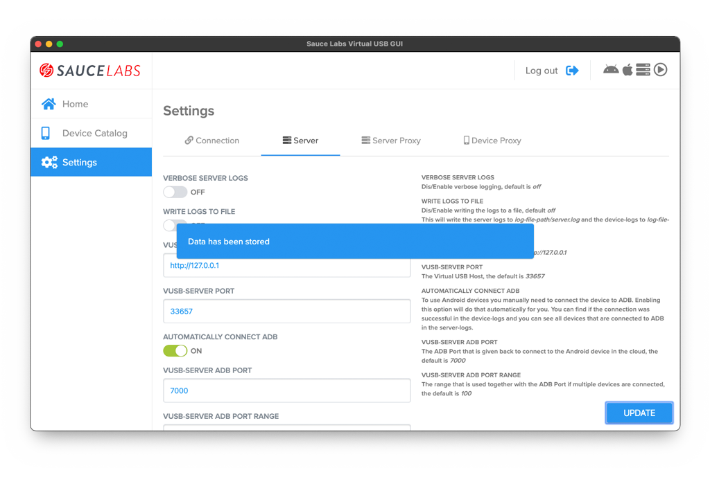

### Connection Settings
The screen will look like this and has the following options.

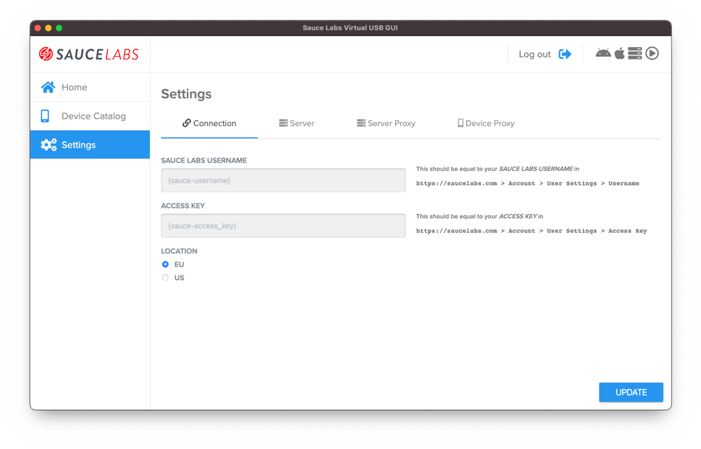

#### SAUCE LABS USERNAME
- **Type:** `string`
- **Default:** Automatically retrieved from Sauce Labs

This is your Sauce Labs username and can also be found here `https://saucelabs.com > Account > User Settings > Username`

#### ACCESS KEY
- **Type:** `string`
- **Default:** Automatically retrieved from Sauce Labs

This is your Sauce Labs Access Key and can also be found here
`https://saucelabs.com > Account > User Settings > Access Key`

#### LOCATION
- **Type:** `string`
- **Default:** EU

The Data Center you want to use.

### Server Settings
The screen will look like this and has the following options.

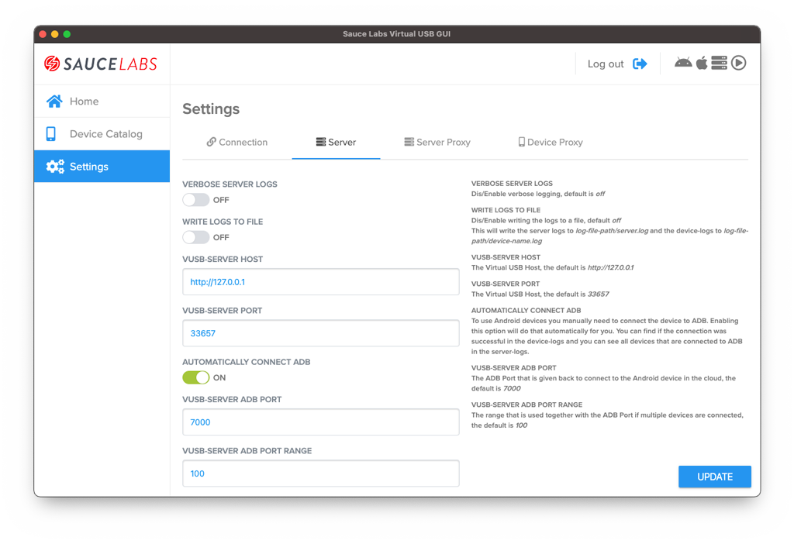

#### VERBOSE LOGS
- **Type:** `string`
- **Default:** OFF

Have verbose server logs.

#### WRITE LOGS TO FILE
- **Type:** `string`
- **Default:** OFF

This will enable writing the logs to a file. If you switch it to `ON` you will get a new field, see below.

##### LOGS FILE PATH
- **Type:** `string`
- **Default:** OFF

This will write the server logs to `log-file-path/server.log` and the device-logs to `log-file-path/device-name.log`

#### VUSB-SERVER HOST
- **Type:** `string`
- **Default:** http://127.0.0.1

The Virtual USB server host

#### AUTOMATICALLY CONNECT ADB
- **Type:** `string`
- **Default:** ON

To use Android devices you manually need to connect the device to ADB. Enabling this option will do that automatically
for you. You can find if the connection was successful in the device-logs and you can see all devices that are connected
to ADB in the server-logs.

#### VUSB-SERVER ADB PORT
- **Type:** `number`
- **Default:** 7000

The ADB Port that is given back to connect to the Android device in the cloud.

#### VUSB-SERVER ADB PORT RANGE
- **Type:** `string`
- **Default:** 100

The range that is used together with the ADB Port if multiple devices are connected.

### Server Proxy Settings
The screen will look like this and has the following options.

#### HOST
- **Type:** `string`
- **Default:** Empty

The host url of the proxy.

#### PORT
- **Type:** `string`
- **Default:** Empty

The port of the proxy.

##### AUTHORIZATION USERNAME
- **Type:** `string`
- **Default:** Empty

If your proxy uses authorisation then this needs to be your username.

#### AUTHORIZATION PASSWORD
- **Type:** `string`
- **Default:** Empty

If your proxy uses authorisation then this needs to be your password

### Device Proxy Settings
The screen will look like this and has the following options.

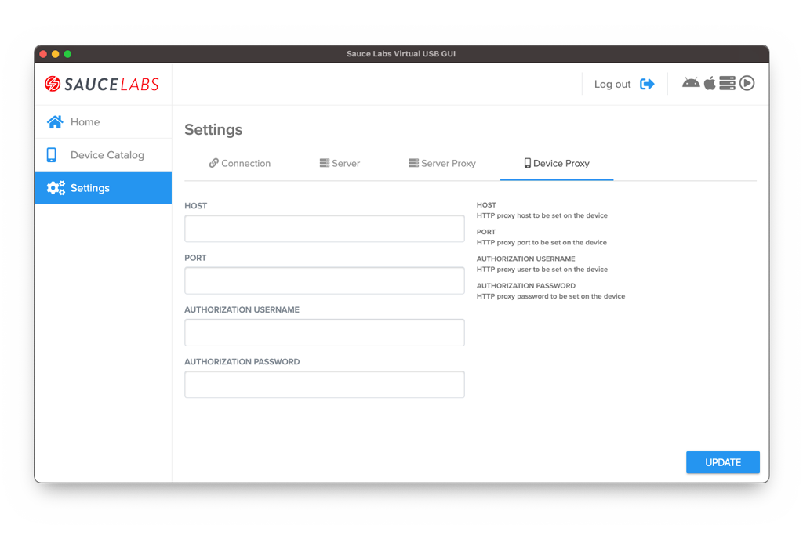

#### HOST
- **Type:** `string`
- **Default:** Empty

The host url of the proxy that will be set when the device will be connected.

#### PORT
- **Type:** `string`
- **Default:** Empty

The port of the proxy that will be set when the device will be connected.

##### AUTHORIZATION USERNAME
- **Type:** `string`
- **Default:** Empty

If your proxy uses authorisation then this needs to be your username. It will be set on each device connection.

#### AUTHORIZATION PASSWORD
- **Type:** `string`
- **Default:** Empty

If your proxy uses authorisation then this needs to be your password. It will be set on each device connection.

## Device Catalog
After you have logged in and set all the needed settings you can select the device you want to use for setting up a
vUSB connection. This screen will look like this.

### Input fields
There are 2 input fields that can be used. 

#### SEARCH DEVICES
- **Type:** `string`
- **Default:** Empty

You can use this to search for specific devices. Each word, minimum is 2 characters long, will be seen as an argument 
and the device needs to match all arguments.

#### TUNNEL IDENTIFIER
- **Type:** `string`
- **Default:** Empty

This is the name of the Sauce Connect Tunnel you want to use. This can be a corporate tunnel, meaning a tunnel that is
already enabled in the Sauce Labs cloud and accesses your corporate internal network, or a local tunnel. You can also 
create a local Sauce Connect tunnel, for more information check 
[this](https://docs.saucelabs.com/secure-connections#sauce-connect-proxy).

> **NOTE:** A local tunnel can only be used when you start a new vUSB connection, see [here](#start-a-new-connection).

### Connecting to a device
The vUSB server needs to be started to be able to connect to a device, this can be done by clicking on the 
**Play**-button in the top right corner. More information about the server can be found [here](#server-monitor).

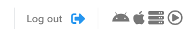

When the server is running the devices will be enabled and it will look like this.

There are 2 ways of connecting to a device:

- Start a new connection
- Connect to an existing session

You can see the differences based on the status badges they have, see [Device statuses](#device-statuses). If you want
to connect to a device then click on the **CONNECT**-switch. It will turn into **CONNECTED** when the connection was 
successful, or **ERROR** if there was an error.

### Disconnecting from a device
When you want to disconnect a device you can click on the **CONNECTED**-switch. It will then stop the connection with 
the device and will, depending how the session was started, in or the [already opened device](#already-opened-device)-, 
or the [clean device](#cleaning-a-device)-state.

If you want to stop using the vUSB client then press the **STOP** button to also stop the vUSB-server.

### Device statuses
#### Clean device
This is a device in clean state, nobody is using it and you can connect to it. When you connect to it a new connection
will be established, see [Connected device from a clean session](#connected-device-from-a-clean-session).

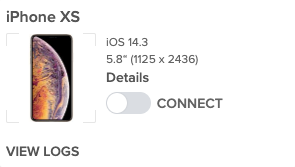

> **NOTE 1:** Connecting to a clean device will give less options to interact with the device, see 
> [Launch live test](#launch-live-test) for more information.

> **NOTE 2:** An iOS session that is started with a clean session is much slower in the interaction/gestures in
> comparison to a session that connects to an existing session that has been started through the Sauce Labs UI, see
> [Already opened device](#already-opened-device).

> **NOTE 3:** If you connect to an iOS device you will be prompted to give access to the vUSB driver to copy over the
> driver. This will look like this\
> 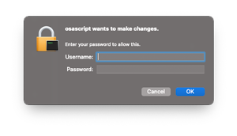

#### Connected device from a clean session
The status of the device when you connected from a [clean device](#clean-device). You can interact with the device by 
clicking on the active [Launch live test](#launch-live-test)-link or you can [view the logs](#view-logs) of the
connected device.

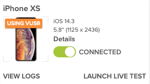

#### Already opened device
Before you use the vUSB GUI, you can start a session in the Sauce Labs UI. This GUI can give you the option to connect 
to it. This will give you the advantage that:

1. You have all menu buttons available as you would normally have in a live session (a session started on a 
   [clean device](#clean-device) doesn't have all buttons available).
1. For iOS the interaction/gestures are much faster in comparison to session started with a 
   [clean device](#clean-device).

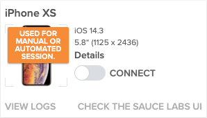

> **NOTE:** If you connect to an iOS device you will be prompted to give access to the vUSB driver to copy over the
> driver. This will look like this\
> 

#### Connected device from an already opened device session
You can only [view the logs](#view-logs) here. You need to check the Sauce Labs UI to be able to interact with the
device, see also [Already opened device](#already-opened-device)

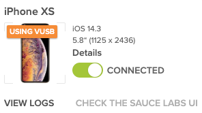

#### Cleaning a device
In most cases the vUSB GUI can determine if the device is cleaning itself. This will look like below.

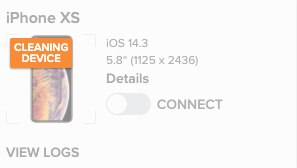

#### Busy device
The vUSB tool can only connect to devices that **you** started with **your** credentials. If someone else is using the
device, the device has a health check, or it's used for automated tests, it will have the busy status as shown below.

### Device links
#### View logs
Here you will find the logs of **starting** the device. All other logs of the device can be found in the
[server logs](#server-logs)

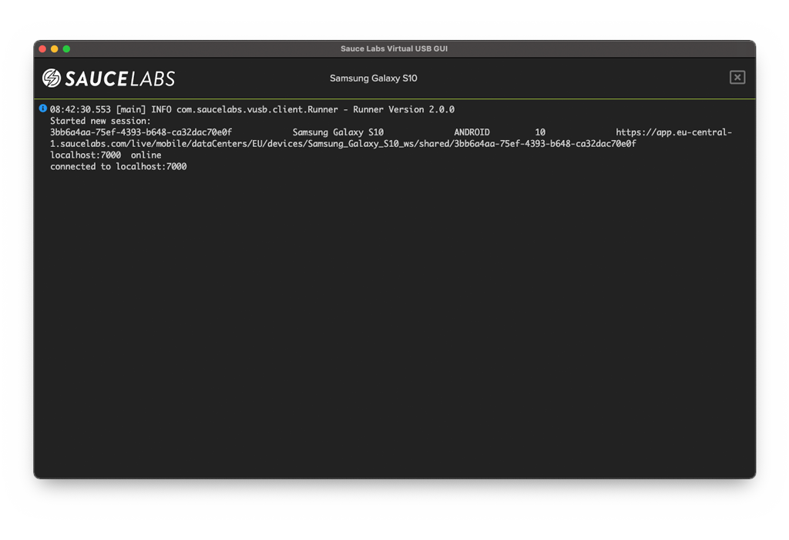

> **NOTE:** The logs act like a terminal and will only show the last **1000** lines. You can also clear the logs as you
> would normally do with your terminal.

#### Check the Sauce Labs UI
This is not an active link and will only be shown when you connected to an existing manual session that you've started 
through the Sauce Labs UI. See [this](#already-opened-device) for more information

#### Launch live test
If you click this link you will get a screen like this.

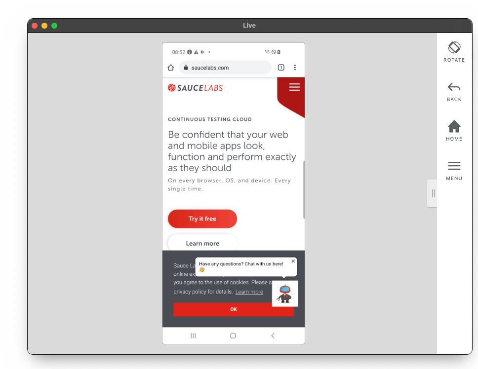

Here uou can interact with the device and the most common buttons are shown.

> **NOTE 1:** Connecting to a clean device will give less options to interact with the device, see
> [Launch live test](#launch-live-test) for more information.

> **NOTE 2:** An iOS session that is started with a clean session is much slower in the interaction/gestures in
> comparison to a session that connects to an existing session that has been started through the Sauce Labs UI, see
> [Already opened device](#already-opened-device).

## Server logs
The logs of the vUSB server and the device logs can be found by clicking on the grey (if not running), or green 
(if active) server button in the top right corner.

This will show the server logs as shown below.

> **NOTE:** The logs act like a terminal and will only show the last **1000** lines. You can also clear the logs as you
> would normally do with your terminal.
